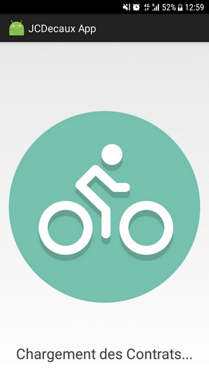
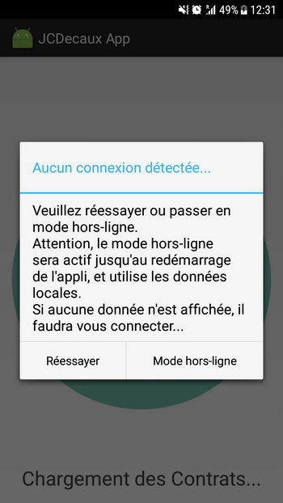

# IUT_Android_JCDecaux

**Conception d'une application Android utilisant l'API JCDecaux, avec diverses fonctionnalités**

## Captures d'écrans

**L'API JCDecaux semble actuellement avoir un problème, ne me permettant pas de prendre d'autres captures d'écran pour le moment...**

#### Écran de chargement

#### Message "Hors-Ligne"

#### Liste des contrats

## Travail demandé

Réaliser une application permettant d'afficher sous forme de liste et sur une carte, les différentes stations de vélos en libre service de la ville de Lyon (et éventuellement d’autres villes), en utilisant l’API proposée par JCDecaux.

Étapes | État (06/04/2018)
-------- | -----
Connexion à l'API (Https, AsyncTask) | ✔
Parsage du JSON | ✔
Modèle de données | ✔
Affichage (ListView, Adapter) | ✔
Custom Adapter | ✔
Amélioration : RecyclerView | ✘
Affichage dans Google Maps | ✔
Amélioration : Icônes Maps | ✔
Amélioration : Recherche | ✘
Amélioration : Clusters | ✘
Amélioration : Calcul d'itinéraire | ✘
Ecran de chargement (Splash Screen) | ✔
Sauvegarde des données en local | ✔
